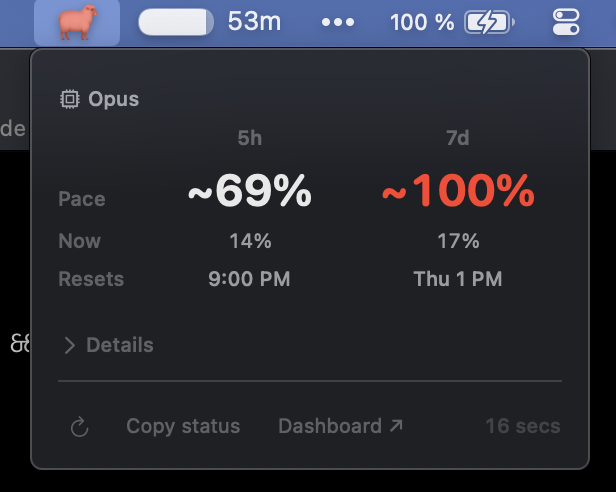
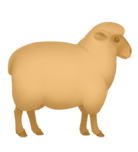

#  TokenShepherd

I kept getting rate-limited on Claude Code without warning. So I built this.

TokenShepherd sits in your Mac menu bar and watches your Claude Code quota. It projects where you'll be at reset and tells you *before* you hit the limit — not after.

<p align="center">
  
</p>

## The Sheep

A calm sheep means keep working. If it changes color, pay attention.

| | State | Meaning |
|---|---|---|
|  | **Calm** | Everything's fine — usage is low, no warning trajectory |
|  | **Warm** | On pace to run out, or usage above 70% |
|  | **Low** | Close to the limit, or projected to hit it |
|  | **Locked** | Rate-limited — shows when you'll be back |

If the sheep is calm, you never need to click it.

## What You See When You Click

- **Pace projections** — the big numbers answer "will I run out?" for both quota windows (5h and 7d), independently colored by severity. Pace leads because it's the actionable signal.
- **Current utilization** — grounding context below the projections. Where you are now vs. where you're heading.
- **Reset times** — when each window resets, so you can plan around it.
- **Collapsible details** — Sonnet 7d utilization and extra usage spend. Hidden when empty. Collapsed by default.
- **Quick actions** — refresh data, copy status to clipboard, open the Anthropic dashboard.

## Notifications

Fires once per reset cycle — won't spam you.

| Notification | When |
|---|---|
| Pace warning | You're burning through quota fast |
| Running low | Usage hits 90% |
| Locked | You've been rate-limited |
| Restored | Limit lifted, you're back |

## Install

Requires **macOS 14+**, **Xcode Command Line Tools**, and **Claude Code logged in**.

```bash
git clone https://github.com/jflairie/tokenshepherd
cd tokenshepherd
make install
```

Builds, signs, installs to `/Applications`, and starts automatically on login.

First launch: you may need to allow it in **System Settings > Privacy & Security**.

## Uninstall

```bash
make uninstall
```

Removes from `/Applications` and disables auto-start.

## Troubleshooting

| Problem | Fix |
|---|---|
| "No credentials" | Log in to Claude Code first (`claude` in terminal) |
| Sheep stays calm/grey | Working as intended — or check that Claude Code is logged in |
| macOS security prompt | Allow in System Settings > Privacy & Security |

## Privacy

Your data stays on your machine. No telemetry, no analytics, no tracking.

TokenShepherd reads the OAuth token from your macOS Keychain and makes one API call to Anthropic every 60 seconds. That's it.

## Architecture

See [CLAUDE.md](CLAUDE.md) for technical architecture, data flow, and design decisions.

## Support

If this saves you from a surprise rate limit, [consider sponsoring](https://github.com/sponsors/jflairie).

## License

MIT
