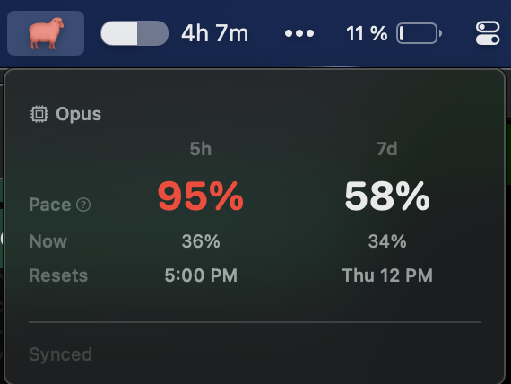
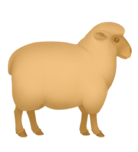
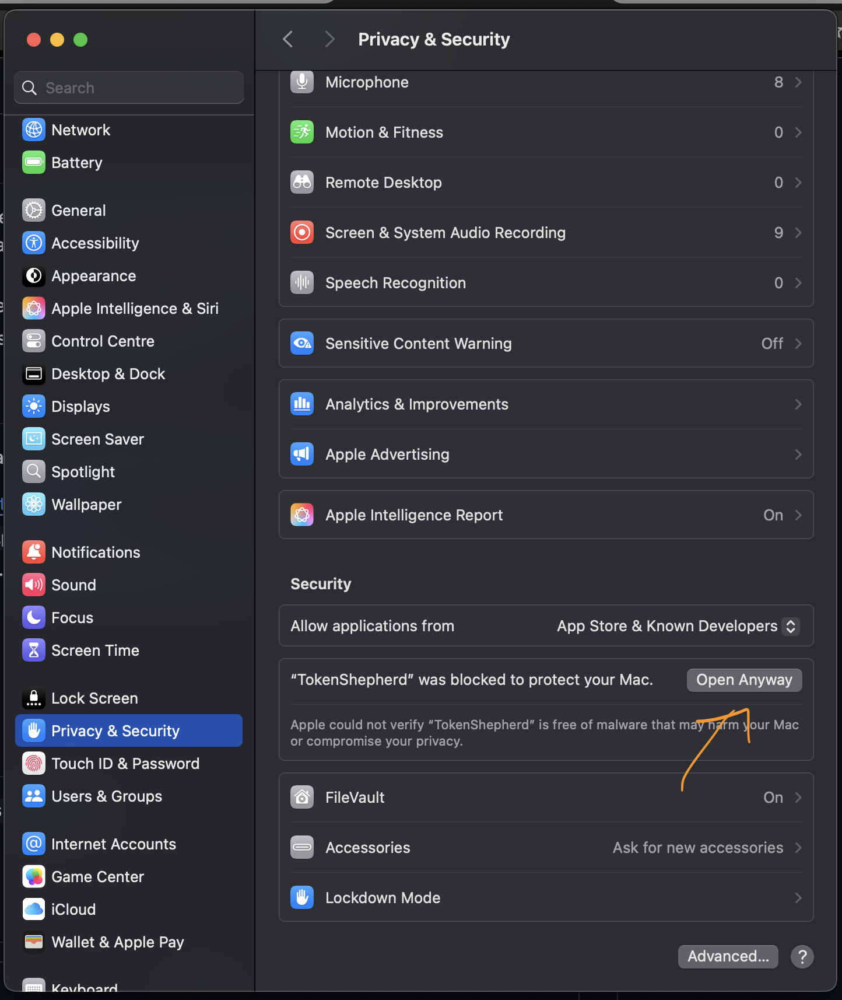

#  TokenShepherd

I kept getting rate-limited on Claude Code without warning. So I built this.

TokenShepherd sits in your Mac menu bar and watches your Claude Code quota. It projects where you'll be at reset and tells you *before* you hit the limit — not after.

<p align="center">
  
</p>

## The Sheep

A calm sheep means keep working. If it changes color, pay attention.

| | State | Meaning |
|---|---|---|
|  | **Calm** | Everything's fine — usage is low, no warning trajectory |
|  | **Warm** | On pace to run out, or usage above 70% |
|  | **Low** | Close to the limit, or projected to hit it |
|  | **Locked** | Rate-limited — shows when you'll be back |

If the sheep is calm, you never need to click it.

## What You See When You Click

- **Pace projections** — the big numbers answer "will I run out?" for both quota windows (5h and 7d), independently colored by severity. Pace leads because it's the actionable signal. >100% means you'll get locked before reset.
- **Current utilization** — grounding context below the projections. Where you are now vs. where you're heading.
- **Reset times** — when each window resets, so you can plan around it.

## Install

Requires **macOS 14+** and **Claude Code** (you can install TokenShepherd first — it'll wait until you log in).

1. Download `TokenShepherd.zip` from the [latest release](https://github.com/jflairie/tokenshepherd/releases/latest)
2. Unzip and drag `TokenShepherd.app` to `/Applications`
3. Open it — macOS will block it the first time. Go to **System Settings > Privacy & Security** and click **Open Anyway**

<p align="center">
  
</p>

The sheep appears in your menu bar. It starts automatically on login — no extra setup needed.

<details>
<summary>Build from source</summary>

Requires Xcode Command Line Tools.

```bash
git clone https://github.com/jflairie/tokenshepherd
cd tokenshepherd
make install
```

Builds, signs, installs to `/Applications`, and starts automatically on login.

</details>

## Uninstall

Drag `TokenShepherd.app` from `/Applications` to the Trash.

<details>
<summary>If you installed from source</summary>

```bash
make uninstall
```

Also removes the LaunchAgent (auto-start on login).

</details>

## Troubleshooting

| Problem | Fix |
|---|---|
| macOS blocks the app | System Settings > Privacy & Security > Open Anyway |
| "Waiting for Claude" | Log in to Claude Code first (`claude` in terminal) — TokenShepherd picks it up automatically |
| Sheep stays calm | Working as intended — calm means your quota is fine |
| Doesn't start on login | Check System Settings > General > Login Items — TokenShepherd should be listed |

## Privacy

Your data stays on your machine. No telemetry, no analytics, no tracking.

TokenShepherd reads the OAuth token from your macOS Keychain and makes one API call to Anthropic every 60 seconds. That's it.

## Architecture

See [CLAUDE.md](CLAUDE.md) for technical architecture, data flow, and design decisions.

## Support

If this saves you from a surprise rate limit, [consider sponsoring](https://github.com/sponsors/jflairie).

## License

MIT
